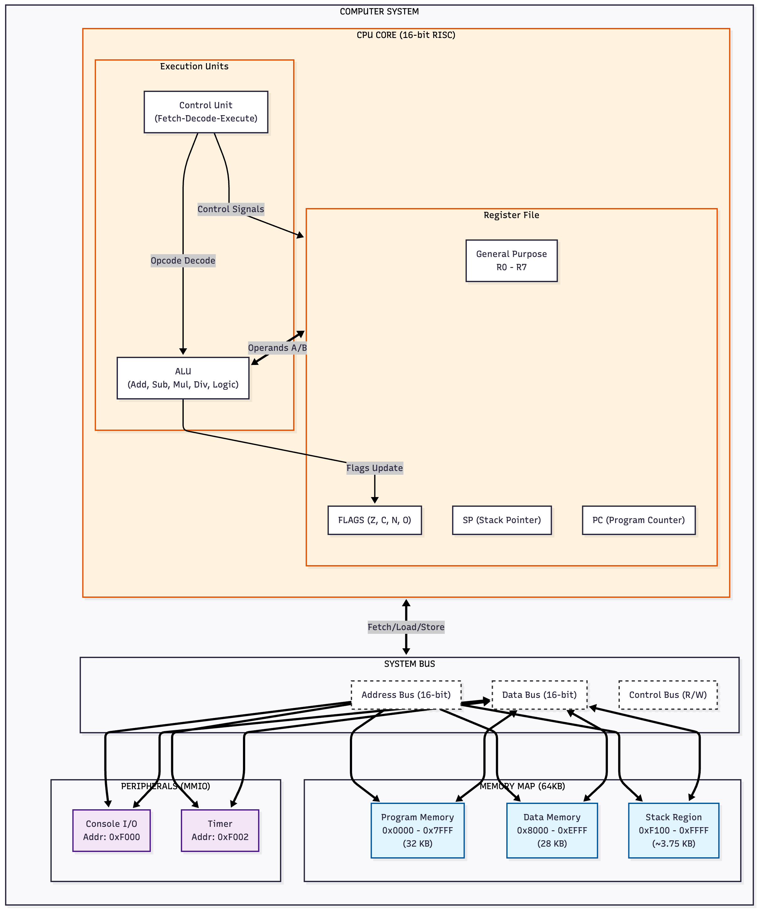

# Software Implementation of a 16-bit RISC Architecture

**Course:** CMPE 220 - System Software

**Team Members:**
* Krutiben Bathani
* Kenil Gopani
* Deep Patidar
* Nikil Thalapaneni

                                           
                                        

## Abstract

This repository contains the source code and documentation for a custom 16-bit RISC-inspired Central Processing Unit (CPU) implemented in C++. The project serves as a comprehensive simulation of the hardware-software interface, featuring a complete toolchain that includes a custom Assembler, an Instruction Set Architecture (ISA) design, and a cycle-accurate Emulator. The primary objective is to demonstrate the Fetch-Decode-Execute pipeline and memory hierarchy management in a constrained embedded environment.

## 1. System Architecture

The core architecture is designed around a Load/Store philosophy, minimizing complex addressing modes in favor of a streamlined instruction set.


*Figure 1: High-level block diagram of the 16-bit CPU Architecture, illustrating the unified bus system and memory-mapped I/O interfaces.*

* **Word Size:** 16-bit native data path and addressing.
* **Memory Model:** Von Neumann architecture with a unified 64KB address space (16-bit width).
* **Register File:** 8 General-Purpose Registers (`R0-R7`) allowing for fast operand access, plus dedicated `PC`, `SP`, and `FLAGS` registers.
* **I/O Interface:** Memory-Mapped I/O (MMIO) located at `0xF000`, simulating direct hardware peripheral access.

## 2. Project Structure

The codebase is organized to separate the translation layer (Assembler) from the execution layer (Emulator).

```text
.
├── docs/                 # Architectural specifications and schematics
├── src/
│   ├── emulator/         # The runtime environment (Virtual CPU & Memory)
│   ├── assembler/        # Two-pass assembler (Source-to-Machine Code)
│   └── common/           # Shared ISA definitions and type headers
├── programs/             # Assembly source files (.asm) for validation
└── Makefile              # Build configuration
````

## 3\. Design Philosophy

The design prioritizes architectural visibility over raw performance. Unlike typical interpreters that optimize for speed, this emulator enforces a strict **Fetch-Decode-Execute** cycle. Each instruction phase is distinct, allowing for precise state inspection and debugging. This approach exposes the internal state transitions of the processor, making it an ideal platform for studying data path logic and control unit design.

## 4\. Compilation & Usage

The project utilizes `Make` for build automation. Ensure a C++11 compliant compiler is available.

### Build the Toolchain

```bash
make all        # Compiles both the Assembler and Emulator
```

### Execution Pipeline

The workflow follows the standard embedded development lifecycle: Assembly -\> Binary -\> Execution.

```bash
# 1. Assemble the source code into a binary image
./build/assembler programs/fibonacci.asm build/fibonacci.bin

# 2. Execute the binary on the virtual CPU
./build/emulator build/fibonacci.bin

# You can run with instruction-level trace enabled for debugging
./build/emulator build/fibonacci.bin -d
```

## 5\. Demonstration Programs

Three benchmark programs are provided to validate the ISA:

1.  **Timer (`timer.asm`):** Validates the arithmetic unit and conditional branching logic through a countdown loop.
2.  **Hello World (`hello.asm`):** Demonstrates the MMIO interface and character encoding.
3.  **Fibonacci Sequence (`fibonacci.asm`):** Stress-tests register allocation and stack management.

## 6\. Documentation

For a deep dive into the microarchitecture, refer to the technical documentation:

  * [**ISA Reference Manual**](docs/isa_specification.md): Detailed bit-level instruction formats.
  * [**Microarchitecture Schematics**](docs/cpu_schematic.md): Data path diagrams and control logic.

<!-- end list -->

