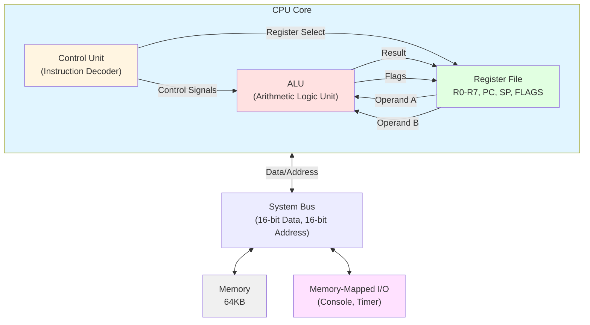
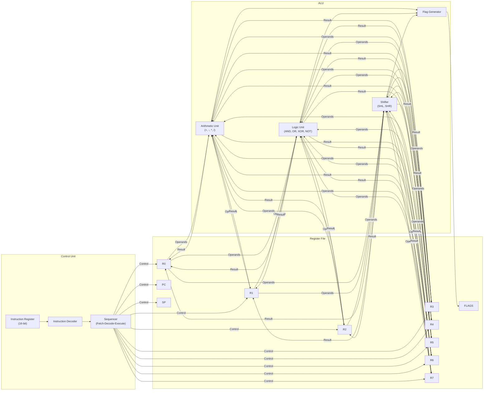
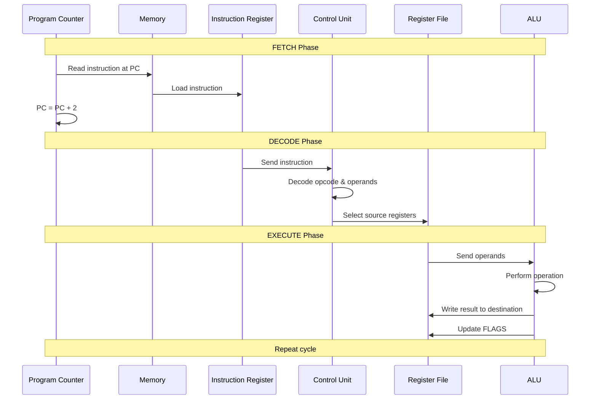
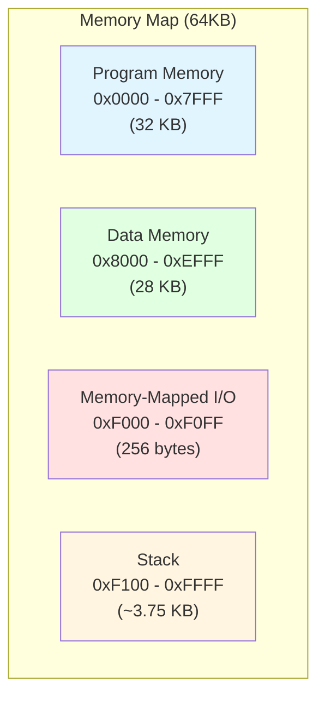
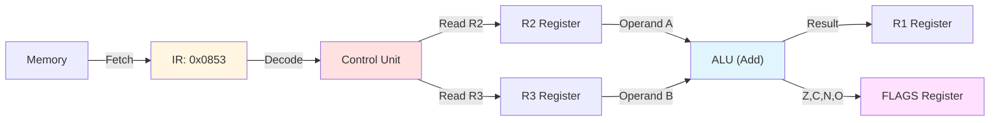
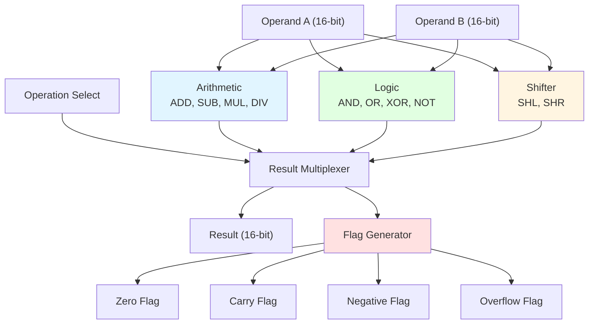
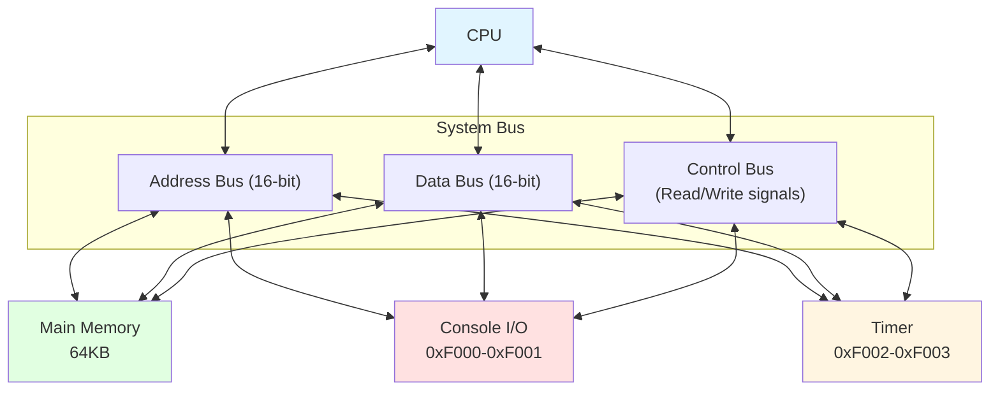

# CPU Architecture Schematic

## Overview

This document provides visual representations of the 16-bit software CPU architecture, showing the relationships between major components and data flow paths.

## CPU Block Diagram



## Detailed CPU Architecture



## Fetch-Decode-Execute Cycle



## Memory Organization



## Data Path for ADD Instruction

Example: `ADD R1, R2, R3` (R1 = R2 + R3)



## ALU Internal Structure



## Instruction Execution Timeline

Example execution of a simple program:

```mermaid
gantt
    title Instruction Execution Timeline
    dateFormat X
    axisFormat %L
    
    section Cycle 1
    Fetch MOVI    :0, 1
    Decode MOVI   :1, 2
    Execute MOVI  :2, 3
    
    section Cycle 2
    Fetch ADD     :3, 4
    Decode ADD    :4, 5
    Execute ADD   :5, 6
    
    section Cycle 3
    Fetch STORE   :6, 7
    Decode STORE  :7, 8
    Execute STORE :8, 9
    
    section Cycle 4
    Fetch HALT    :9, 10
    Decode HALT   :10, 11
    Execute HALT  :11, 12
```



## System Bus Architecture



## Register File Organization

```
┌─────────────────────────────────────┐
│         Register File               │
├──────────────┬──────────────────────┤
│   R0 (16b)   │  General Purpose     │
│   R1 (16b)   │  General Purpose     │
│   R2 (16b)   │  General Purpose     │
│   R3 (16b)   │  General Purpose     │
│   R4 (16b)   │  General Purpose     │
│   R5 (16b)   │  General Purpose     │
│   R6 (16b)   │  General Purpose     │
│   R7 (16b)   │  General Purpose     │
├──────────────┼──────────────────────┤
│   PC (16b)   │  Program Counter     │
│   SP (16b)   │  Stack Pointer       │
│ FLAGS (16b)  │  Status Flags        │
└──────────────┴──────────────────────┘

FLAGS Register Detail:
┌───┬───┬───┬───┬───┬───┬───┬───┬───┬───┬───┬───┬───┬───┬───┬───┐
│15 │14 │13 │12 │11 │10 │ 9 │ 8 │ 7 │ 6 │ 5 │ 4 │ 3 │ 2 │ 1 │ 0 │
├───┴───┴───┴───┴───┴───┴───┴───┴───┴───┴───┴───┼───┼───┼───┼───┤
│           Reserved (0)                         │ O │ N │ C │ Z │
└────────────────────────────────────────────────┴───┴───┴───┴───┘
  O = Overflow, N = Negative, C = Carry, Z = Zero
```

## Component Responsibilities

### Control Unit
- Fetches instructions from memory
- Decodes instruction opcodes and operands
- Generates control signals for other components
- Manages the fetch-decode-execute cycle
- Updates Program Counter

### Register File
- Stores 8 general-purpose registers (R0-R7)
- Maintains special registers (PC, SP, FLAGS)
- Provides fast access to operands
- Receives results from ALU

### ALU (Arithmetic Logic Unit)
- Performs arithmetic operations (add, subtract, multiply, divide)
- Performs logical operations (AND, OR, XOR, NOT)
- Performs shift operations (shift left, shift right)
- Generates status flags (Zero, Carry, Negative, Overflow)

### Memory
- 64KB address space
- Stores program instructions and data
- Provides memory-mapped I/O
- Supports read/write operations

### System Bus
- Connects CPU to memory and I/O devices
- Carries addresses (16-bit address bus)
- Carries data (16-bit data bus)
- Carries control signals (read/write)
